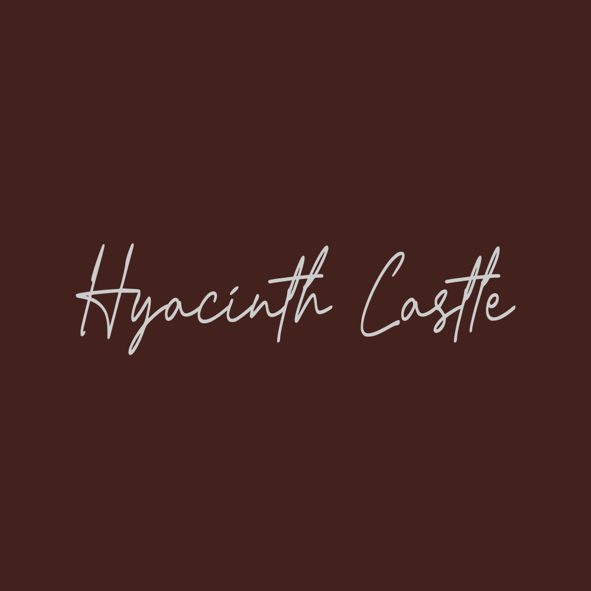
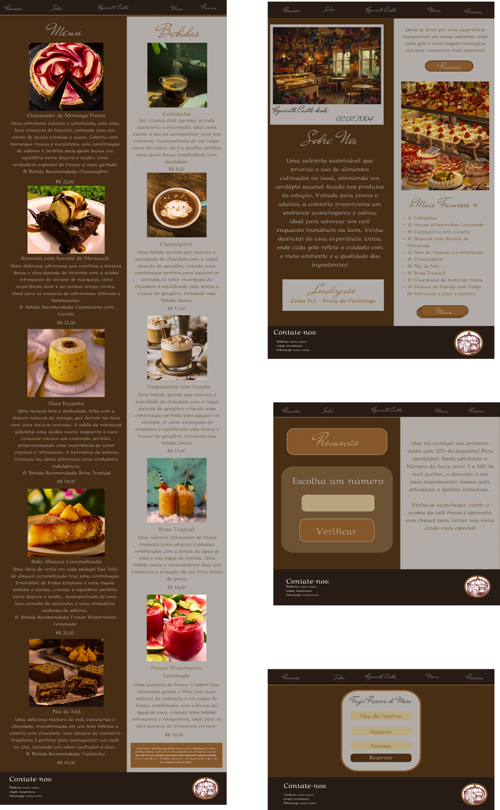

# 🌿 Hyacinth Castle - Projeto Teórico de Cafeteria

Uma cafeteria sustentável que prioriza o uso de alimentos cultivados no local, oferecendo um cardápio sazonal focado nos produtos da estação.
Voltada para *jovens e adultos, a cafeteria proporciona um ambiente **aconchegante e calmo*, ideal para saborear um café enquanto trabalham ou leem.

> Venha desfrutar de uma experiência única, onde cada gole reflete o cuidado com o meio ambiente e a qualidade dos ingredientes!

📍 *Localização*: Brasil, Zona Sul – Praia do Flamengo

---

## 🧩 Estrutura do Projeto

- **Página Principal**: Apresenta o conceito da cafeteria, destacando sua proposta de sustentabilidade e ambiente acolhedor.
- **Página de Menu**: Exibe o cardápio completo da cafeteria, incluindo todas as opções de bebidas e pratos disponíveis para os clientes.
- **Página de Promoções**: Contém um sorteador de números, onde os clientes podem participar para ganhar descontos.
- **Formulário de Reservas**: Permite aos clientes fazerem reservas, coletando dados como nome, telefone, horário e número de pessoas.
- **Layout Responsivo**: O design se ajusta a diferentes tamanhos de tela, proporcionando uma boa experiência tanto em desktop quanto em dispositivos móveis.
- **Organização de Cores e Design com Base no Branding**: A paleta de cores e o design foram escolhidos para transmitir uma sensação acolhedora e sustentável.

## 🎨 Paleta de Cores

| Cor             | Hex       |
|------------------|----------|
| 	Shadow Black    | #261B15 |
| Cafe Noir (Espresso)      | #472E15 |
| Windsor Tan   | #A66D36 |
| 	Coffee      | #6E5234 |
| 	Sand            | #B8A77E |
| 	Neon Silver            | #CCCCCC |

---

## 🖌 Figma

Protótipos e design visual criados no Figma.

---

## 🧠 Banco de Dados - Esquema Lógico

Reserva (
  IDR,
  primeiroNome,
  sobrenome,
  telefone,
  email,
  dataReserva,
  horario,
  pessoasQ,
  restricaoA
)

## 🗄 Criação da Tabela de Reservas (MySQL)

CREATE DATABASE hyacinthCastle;
USE hyacinthCastle;
SELECT DATABASE();
SHOW DATABASES;

CREATE TABLE hyacinthCastle.reservas (
  idR SMALLINT PRIMARY KEY AUTO_INCREMENT,
  primeiroNome VARCHAR(30) NOT NULL,
  sobrenome VARCHAR(50) NOT NULL,
  telefone VARCHAR(11) NOT NULL,
  email VARCHAR(100) NOT NULL,
  dataReserva DATE NOT NULL,
  horario TIME NOT NULL,
  pessoaQ TINYINT NOT NULL,
  restricaoA VARCHAR(300)
);

## 💻 Tecnologias Utilizadas

- *HTML5* – estrutura da página
- *CSS3* – estilização e responsividade
- *JavaScript* – sorteador de números
- *Figma* – design da interface
- *XAMPP / MySQL* – banco de dados local para reservas

